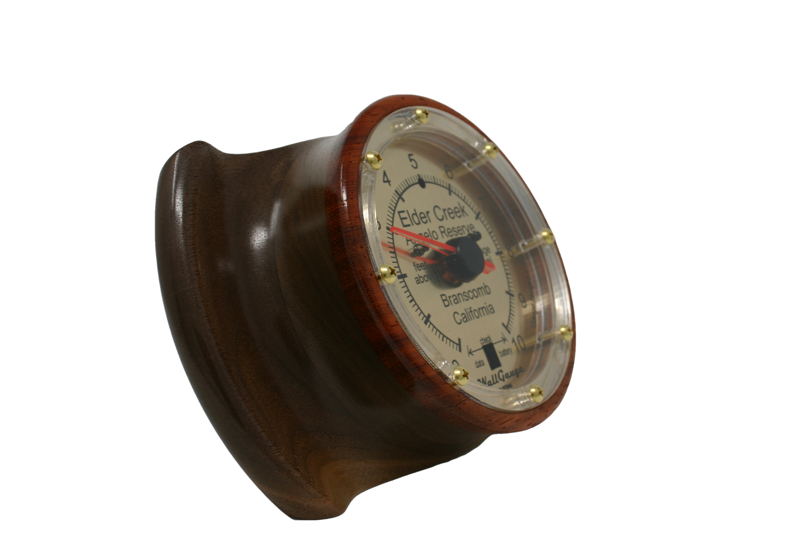

# Elder Creek Gauge

This WallGauge App reads real-time gauge height data of the Elder Creek gauge in Mendocino county, California (Angelo Reserve). The data is sourced from the USGS web site (see our open sourced [river data getter](https://wallgauge-gaugeapps.github.io/RiverDataGetter/) for API details) and publicly available at the [Elder Creek USGS web site](https://waterdata.usgs.gov/monitoring-location/11475560/). The gauge height is sent to a physical battery powered WallGauge for display. Data are read from the USGS endpoint about every 10 minutes. You should get approximately 5 to 7 years battery life out of three AAA batteries.

---

## WallGuge Pics

